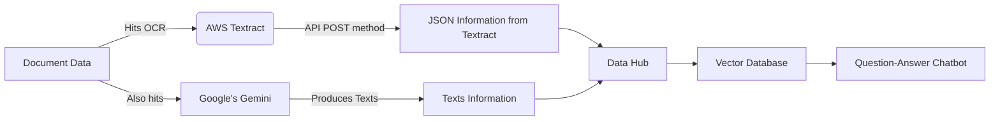
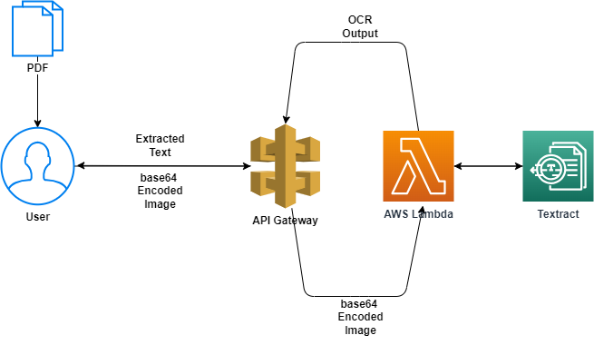

# 📸 Snap & Analyze with Streamlit 🌟

Welcome to the repository of our fantastic Streamlit application, where capturing a moment and unraveling its mysteries is just a click away! 🚀

## What's Inside? 🎁

This application isn't just your run-of-the-mill photo app. Oh no, it's much more! 🌈

- **Snap a Pic**: Use your awesome webcam to capture anything that piques your interest. 📷
- **Resize & Marvel**: Watch as the app magically resizes your image for optimal analysis. ✨
- **Analyze with AI**: Send your image to the mystical realms of Google's Gemini API and get insightful texts about your picture. 🤖🔍
- **Download & Share**: Save your amazing findings and share them with the world! 🌍

## Main Diagram



Explanation of the Diagram:
- **A**: Represents the initial document data.
- **B**: AWS Textract, where the OCR process happens.
- **C**: Google's Gemini, another process that the document data goes through.
- **D**: Represents the JSON information output from AWS Textract.
- **E**: Texts information output from Google's Gemini.
- **F**: A data hub where information from both Textract and Gemini converge.
- **G**: Vector database created from the data hub.
- **H**: Final stage where the information is used in a question-answer chatbot.

### System Architect (AWS)

The AWS module from the above main diagram can be presented using the following system architect. This is a demontration only as in practice the modules could be changed. The system architect proposes a workflow for user to interact with **Textract** using **API Gateway**. The **API Gateway** points to a **Lambda** function using a *POST* method. When making the API call, the user sends a **base64** encoded image as part of the payload (e.g. can be a *.json* file). The payload is sent to the **Lambda** function where it is fed into **Textract** as input arguments. The **Lambda** function returns the [OCR](https://en.wikipedia.org/wiki/Optical_character_recognition) output from **Textract** and the output is passed back to the user via the **API**. 



#### TODO

This is left optional. The raw output from **OCR** is a big *.json* file and the important information is usually saved inside, notified by "BlockType": "LINE", of which we can use to extract actual useful information along with *width*, *height*, *left*, and *top* to mark its location in the document. 

The #TODO item here is dependent on the next step of the use case. Every use case is different. The use cases can be document processing, medical form creation, clinical trial protocols, and so on. For now, we leave it as #TODO because we do not have a particular use case to follow. When a use case and its schema is defined, the code in this project can be used as a first step to deliver the *OCR* output for next step usage. 

## Getting Started 🚀

To embark on this journey of photographic analysis, you'll need to follow these simple steps:

1. **Clone This Repository**:
    ```bash
    git clone https://your-repository-link.git
    ```

2. **Install Dependencies**:
    Ensure you have Streamlit, Pillow, and Requests installed. Run:
    ```bash
    pip install streamlit Pillow requests
    ```

3. **Set Your API Key**:
    Our app uses the power of Google's Gemini API. Don't forget to set your API key!
    ```bash
    export API_KEY='Your-Google-API-Key'
    ```

4. **Launch the App**:
    Get the app up and running with:
    ```bash
    streamlit run app.py
    ```

5. **Capture, Analyze, Enjoy!** 🎉

## Contributions 🤝

Got ideas to make this app even more fabulous? Contributions are more than welcome! Fork the repo, make your changes, and hit us with that pull request. Let's make photo analysis fun for everyone! 🌟

## License 📜

This project is licensed under the MIT License - see the [LICENSE](LICENSE) file for details.