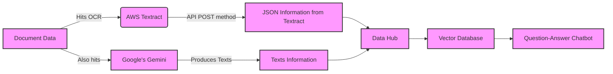

# 📸 Snap & Analyze with Streamlit 🌟

Welcome to the repository of our fantastic Streamlit application, where capturing a moment and unraveling its mysteries is just a click away! 🚀

## What's Inside? 🎁

This application isn't just your run-of-the-mill photo app. Oh no, it's much more! 🌈

- **Snap a Pic**: Use your awesome webcam to capture anything that piques your interest. 📷
- **Resize & Marvel**: Watch as the app magically resizes your image for optimal analysis. ✨
- **Analyze with AI**: Send your image to the mystical realms of Google's Gemini API and get insightful texts about your picture. 🤖🔍
- **Download & Share**: Save your amazing findings and share them with the world! 🌍

## System Diagram



Explanation of the Diagram:
- **A**: Represents the initial document data.
- **B**: AWS Textract, where the OCR process happens.
- **C**: Google's Gemini, another process that the document data goes through.
- **D**: Represents the JSON information output from AWS Textract.
- **E**: Texts information output from Google's Gemini.
- **F**: A data hub where information from both Textract and Gemini converge.
- **G**: Vector database created from the data hub.
- **H**: Final stage where the information is used in a question-answer chatbot.

In your Markdown file, this Mermaid diagram will visually represent the flow of data in your workflow from left to right. Each step is connected to show how the data moves through different stages and gets transformed into the final output for the chatbot.

## Getting Started 🚀

To embark on this journey of photographic analysis, you'll need to follow these simple steps:

1. **Clone This Repository**:
    ```bash
    git clone https://your-repository-link.git
    ```

2. **Install Dependencies**:
    Ensure you have Streamlit, Pillow, and Requests installed. Run:
    ```bash
    pip install streamlit Pillow requests
    ```

3. **Set Your API Key**:
    Our app uses the power of Google's Gemini API. Don't forget to set your API key!
    ```bash
    export API_KEY='Your-Google-API-Key'
    ```

4. **Launch the App**:
    Get the app up and running with:
    ```bash
    streamlit run app.py
    ```

5. **Capture, Analyze, Enjoy!** 🎉

## Contributions 🤝

Got ideas to make this app even more fabulous? Contributions are more than welcome! Fork the repo, make your changes, and hit us with that pull request. Let's make photo analysis fun for everyone! 🌟

## License 📜

This project is licensed under the MIT License - see the [LICENSE](LICENSE) file for details.